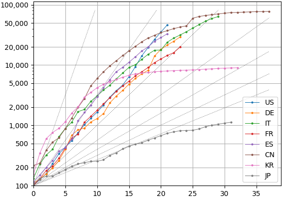

Daily Growth of COVID-19 Cases or Deaths Based on ECDC Data
===========================================================

Growth in COVID-19 cases or deaths is plotted using two different frameworks.
Both versions read the [ECDC COVID-19
data](https://www.ecdc.europa.eu/en/publications-data/download-todays-data-geographic-distribution-covid-19-cases-worldwide)
in Excel format. They create a chart similar to one from the [Financial
Times](https://www.ft.com/graphics). It plots the growth in COVID-19 cases or
deaths from the day each country reached 100 cases or 10 deaths, respectively.

Matplotlib
----------

The [Python Matplotlib version](./matplotlib/) runs from the command line to
locally display the chart.

D3
--

The [JavaScript D3 version](./d3/) runs in a web browser.

ECDC Data Format
----------------

The ECDC data is in a spreadsheet in this format. Data is grouped by
country in reverse date order. The column "Countries and territories"
is unsuitable for grouping because of inconsistent capitalization
("CANADA" and "Canada").

| DateRep    | Day | Month | Year | Cases | Deaths | Countries and territories | GeoId |
|------------|-----|-------|------|-------|--------|---------------------------|-------|
| 2020-03-20 | 20  | 3     | 2020 | 0     | 0      | Afghanistan               | AF    |
| 2020-03-19 | 19  | 3     | 2020 | 0     | 0      | Afghanistan               | AF    |
| 2020-03-18 | 18  | 3     | 2020 | 1     | 0      | Afghanistan               | AF    |
| 2020-03-17 | 17  | 3     | 2020 | 5     | 0      | Afghanistan               | AF    |
| ...        |     |       |      |       |        |                           |       |
| 2019-12-31 | 31  | 12    | 2019 | 0     | 0      | Vietnam                   | VN    |
| 2020-03-20 | 20  | 3     | 2020 | 0     | 0      | Zambia                    | ZM    |
| 2020-03-19 | 19  | 3     | 2020 | 2     | 0      | Zambia                    | ZM    |
