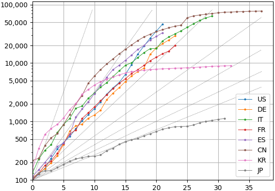

Matplotlib Version of COVID-19 Growth Plot
==========================================

Theses scripts use [pandas](https://pandas.pydata.org/) and
[Matplotlib](https://matplotlib.org/) to compute and plot the growth in cases
and deaths due to COVID-19.  The scripts read the [ECDC COVID-19
data](https://www.ecdc.europa.eu/en/publications-data/download-todays-data-geographic-distribution-covid-19-cases-worldwide)
in Excel format. [`plot-covid-19-ecdc.py`](./plot-covid-19-ecdc.py) displays a
chart similar to one from the [Financial
Times](https://www.ft.com/graphics). It plots the growth in COVID-19 cases or
deaths from the day each country reached 100 cases or 10 deaths, respectively.
[`growth-covid-19-ecdc.py`](./growth-covid-19-ecdc.py) outputs tab-separated
data sorted by the average daily growth over the last N days.

Package dependencies are listed in [`requirements.txt`](./requirements.txt):

    pip3 install -r requirements.txt

If there is a problem displaying the plot in Ubuntu, the following may help:

    sudo apt install python3-tk

